# 1、开发板驱动安装和Mixly

## （1）米思奇（Mixly）软件下载和安装

打开米思奇的官方网站http://mixly.org/，在页面中找到软件平台，

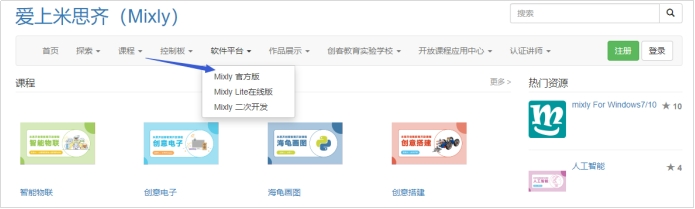

点击下载Mixly官方版 ，

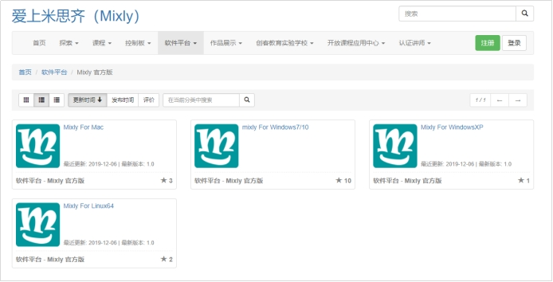 

有四个版本的软件可以供选择，现在的电脑大部分都是WIN10的系统，我们下面的教程就是基于WIN10系统来做的。点击mixly for win7/10,会出现两个下载地址，一个是下载链接，一个是网盘文件，

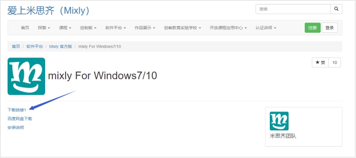 

我们选择其中一个下载链接，点击下载，

 

会出现一个36MB的压缩文件，这个就是米思奇软件的压缩包。压缩包下载好之后，解压缩到电脑的其中一个硬盘（建议不要放在系统盘）。

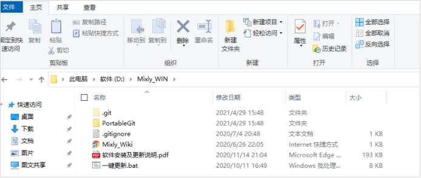 

点击一键更新.bat,会出现以下的界面

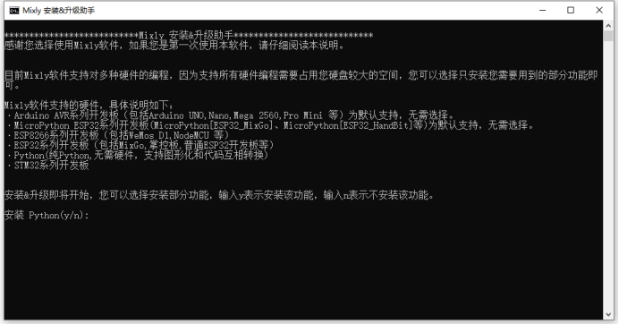 

新版的米思奇软件提供了可选项，有一些功能可以不安装，在页面中输入y或者n,来完成安装的过程。

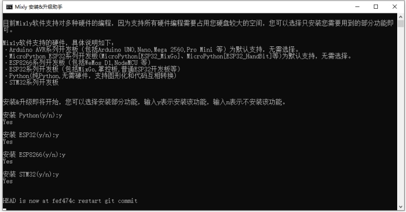 

系统已经在自动安装了，

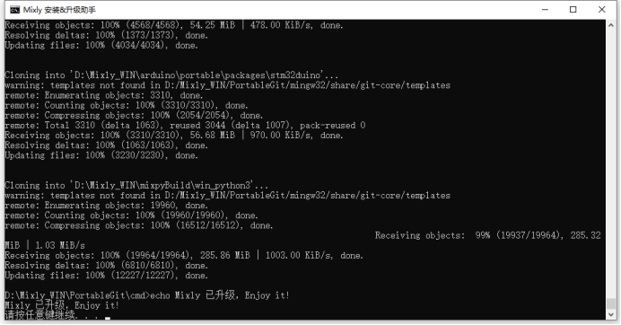

几分钟过后，按下任意键，米思奇软件就安装完成了。

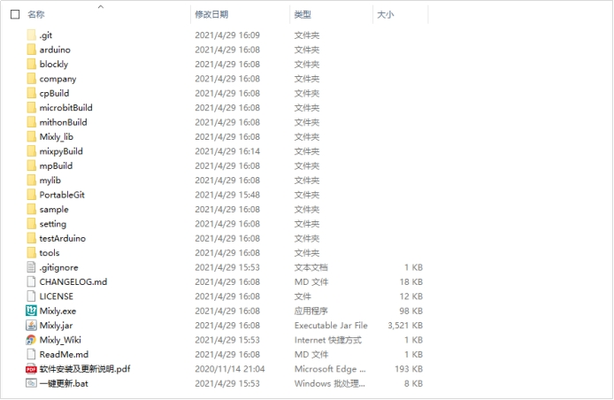 

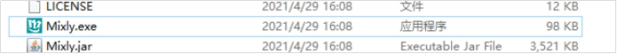 

鼠标右键点击Mixly.exe 发送到电脑桌面，方便日后我们使用。

## （2）米思奇软件介绍

米思奇（Mixly）是一个免费的开源图形Arduino编程软件，基于Google的图形化编程框架。它是创意电子开发的免费开源图形编程工具；是完整支持创意电子教育的生态系统；是创客教育者实现梦想的舞台。        

安装好了软件，我们点击电脑桌面上的mixly图标来打开软件，

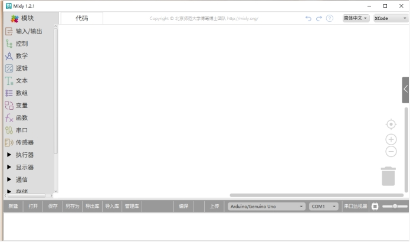 

代码程序上传到Arduino开发板或者兼容板之前，必须先了解米思奇软件工具栏中出现的每个区和接口的功能。

### 界面布局

介绍面总的分为四大功能区域块。

1.基本功能块区

2.程序构建区

3.代码区

4.信息提示区

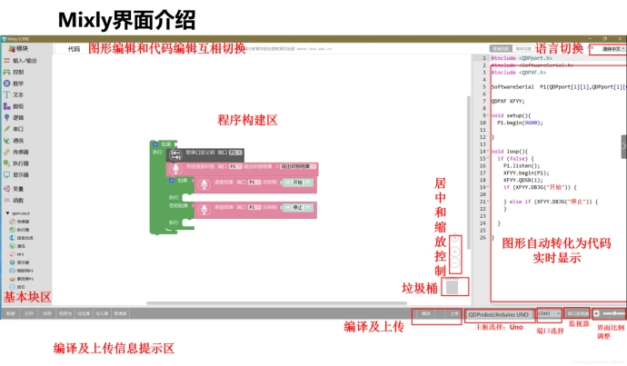 

### 基本功能块区

输入输出

IO相关功能块

控制

程序流程控制相关功能块

数学

数学运算相关功能块

文本

字符串操作相关功能块

数组

数组相关功能块

逻辑

逻辑关系的相关功能块

串口

串口通信相关功能块

通信

以太网,红外遥控等通讯功能块

储存

数据储存相关功能块 (高级视图)

传感器

通用传感器相关功能块

执行器

通用执行器相关功能块

显示器

显示相关功能块

以太网

以太网通讯功能块(高级视图)

变量

变量操作相关功能块

函数

函数相关功能块

factory

自定义代码功能块(高级视图)

### 程序建构区

该区域为程序功能拼接区域。将功能块从左侧块区拖入程序建构区进行拼接。该区域的右下角有个垃圾桶，可以将不用的代码拖进去删除，也可以将不用的代码直接往最左方拖拽（模块选择区），同样可以删除代码。当然，点击不用的代码后点击键盘 Delete也可将代码删除，还可以右键点击块选择删除块.

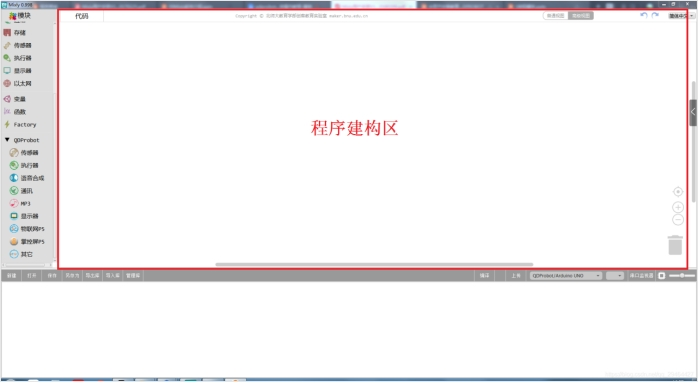 

### 视图缩放

在垃圾桶的上方有两个图形，一个是 ⊕一个是Θ 。该图形可放大或缩小程序构建区模块的大小。在⊕的上方有一个 按钮，这个按钮的功能是将模块的大小恢复至标准大小，并居中.

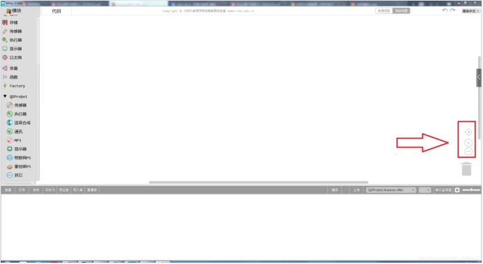 

### 功能切换

语言切换:在该区域的右上角，还可以切换语言显示的种类。

撤消/重做:撤销功能是当编写代码时误删模块后，便可以点击左箭头或者直接按 Ctrl+Z 来恢复误删代码；而重做则是和 Ctrl+Z 相反。

视图切换:普通视图和高级视图来进行视图之间的切换。

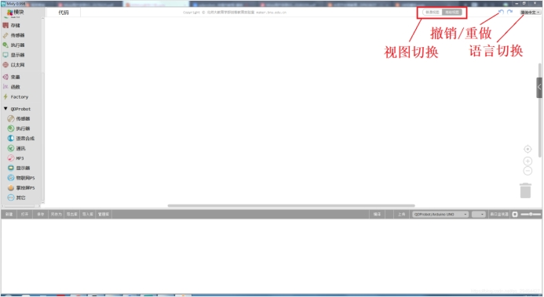 

### 文件操作区

新建:新建项目文件

打开:打开项目文件

保存:保存项目文件

另存为:另存项目文件

导出库:导出当前项目为库文件

导入库:导入第三库文件

管理库:库的删除和重命名等操作

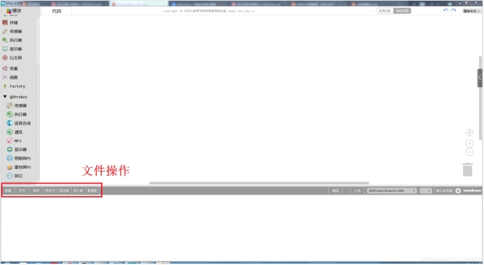 

库文件是为了方便代码分享.将一个功能集成在个函数中。之后导出库 文件.就可以分享给他人使用.

### 代码区

点击代码可以对当前模块自动生成的代码进行修改，修改后如不切换回图形区,进行编译和下载,将按照修改的代码进行编译或者下载.但如果切换回图形区.代码会恢复为图形区的代码.

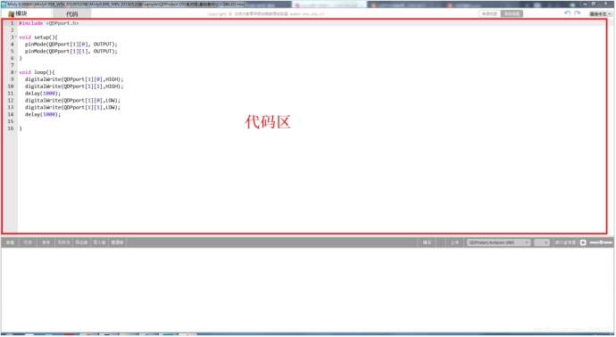 

### 程序下载及串口监视

编译:将程序编译为机器执行码.编译过程和结果会在信息显示区显示

上传:编译程序并上传至主板,上传信息会在信息显示区显示.

主板选择:选择主板类型及连接的端口

串口监视:用于监视主板从串口发来的信息或者给主板发送信息.需编程.主要用于调试程序或者显示信息用.

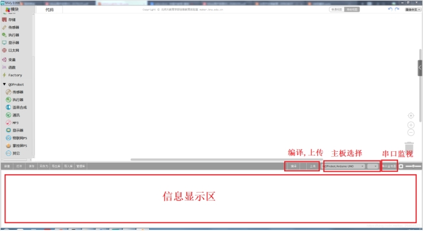

*需要注意的是在上传程序时请关闭串口监视窗口.否则会导致程序上传失败*

## （3）安装PLUS开发板驱动

### 第1小节  简单介绍keyes PLUS开发板

Keyes Plus 开发板是一款完全兼容Arduino IDE开发环境的控制板。它包含官网的UNO开发板的所有功能，并且在UNO开发板的基础上，我们做了一些改进，使它的功能更加强大。具体改进如下图。为了方便接线，我们还配了1根长度为1米的type-c接口的USB线。

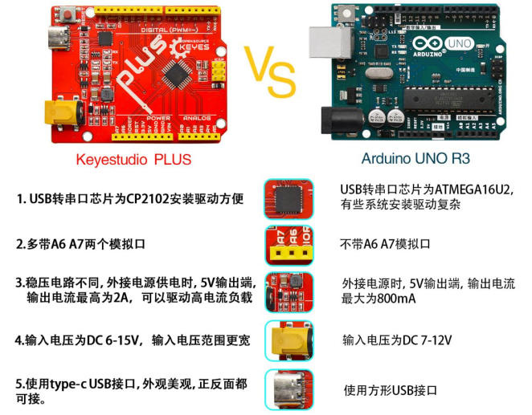 

 

**规格参数**

- 微控制器：ATMEGA328P-AU
- USB转串口芯片：CP2102
- 工作电压：DC 5V
- 外接电源: DC 6-15V（建议9V）
- 数字I/O引脚: 14 (D0-D13)
- PWM通道：6 (D3 D5 D6 D9 D10 D11)
- 模拟输入通道（ADC）: 8(A0-A7)
- 每个I/O直流输出能力: 20 mA
- 3.3V端口输出能力: 50 mA
- Flash Memory: 32 KB（其中引导程序使用0.5 KB）
- SRAM:2 KB (ATMEGA328P-AU)
- EEPROM: 1 KB (ATMEGA328P-AU)
- 时钟速度:16MHz
- 板载LED引脚:D13

**各个接口和主要元件说明**

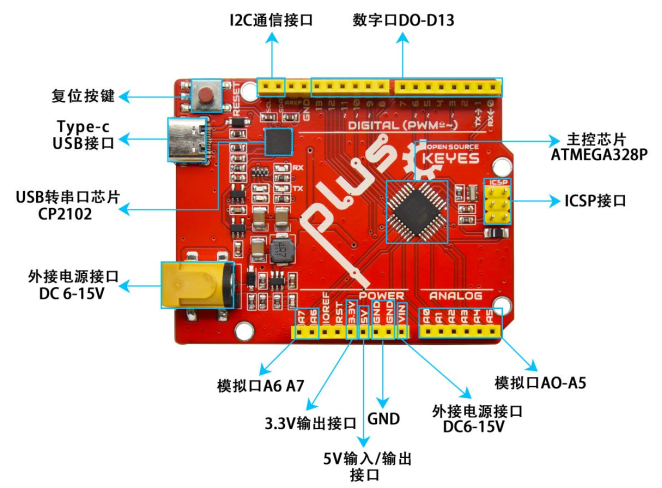 

**特殊功能接口说明**

- 串口通信接口：D0为RX、D1为TX
- PWM接口（脉宽调制）：D3 D5 D6 D9 D10 D11
- 外部中断接口：D2(中断0)和D3 (中断1)
- SPI通信接口：D10为SS、D11为MOSI、D12为MISO、D13为SCK
- IIC通信端口：A4为SDA、A5为SCL

### 第2小节  开发板驱动安装

软件下载完毕，我们开始为Keyes Plus 开发板安装驱动。Keyes Plus 开发板的USB转串口芯片用的是著名的CP2102 芯片，米思奇1.0以上的版本里就已经包含了这个芯片的驱动程序，这样我们使用起来会非常方便。一般插上USB，电脑就会识别到硬件，WINDOWS就会自动安装CP2102的驱动。

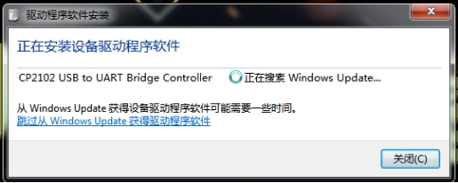

如果驱动安装不成功，或者你想手动安装驱动，请打开电脑的设备管理器

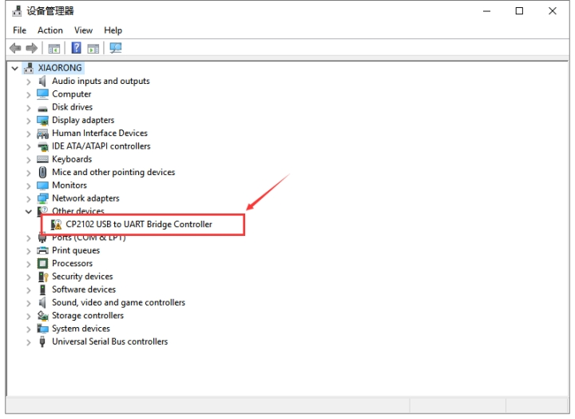

显示CP2102的驱动没有安装成功，有一个黄色的感叹号。我们双击硬件更新驱动

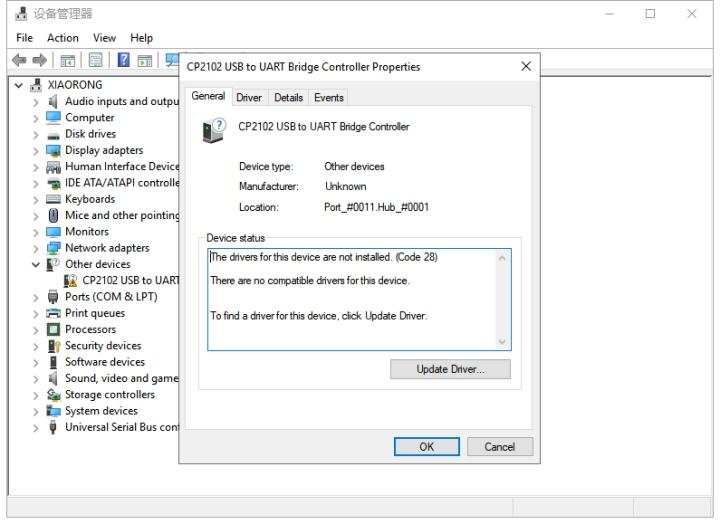 

 浏览计算机查找驱动程序，先找到我们安装的米思奇开发软件，

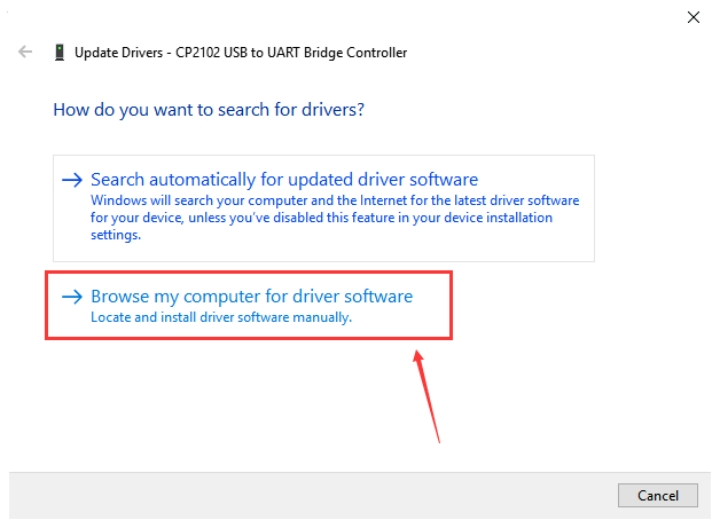 

里面有个Arduino文件夹，打开就里面有个DIRVERS文件夹，打开文件夹就能看到CP210X系列芯片的驱动，

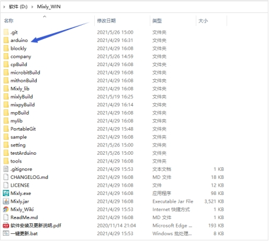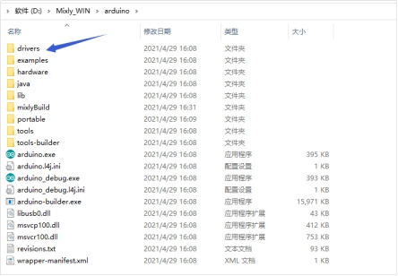 

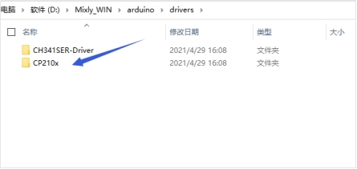 

 我们选择这个文件夹，然后点击确定，驱动安装成功。

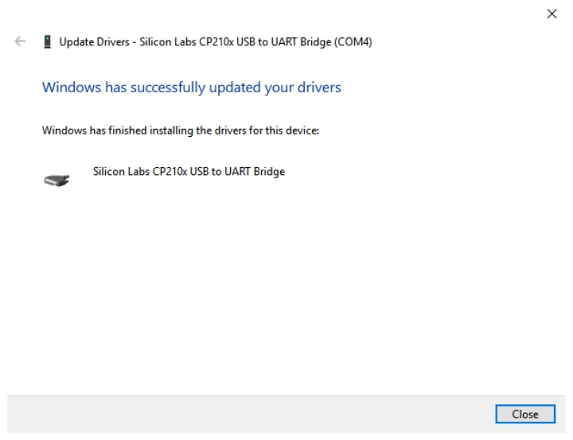 

这个时候再打开设备管理器，我就可以看到CP2102的驱动程序已经安装成功了，刚刚的那个黄色的感叹号不见了。

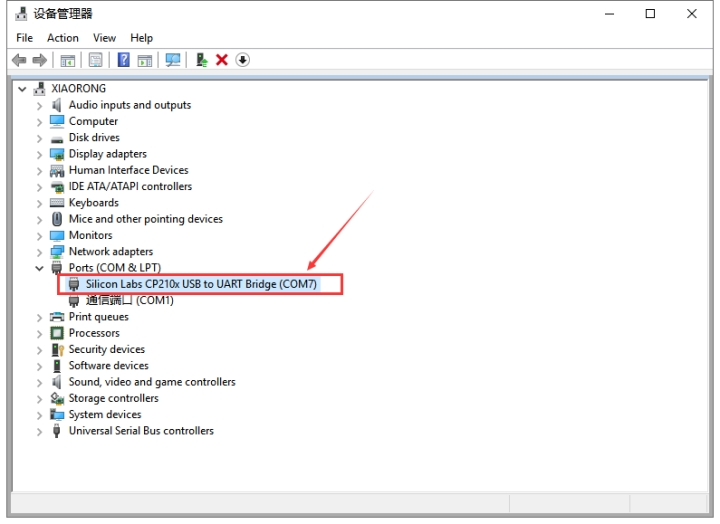 

##  （4）导入KEYES智能小车 mixly库文件

[库文件下载](./Keyes智能小车.zip)

打开米思奇软件，点击导入库，

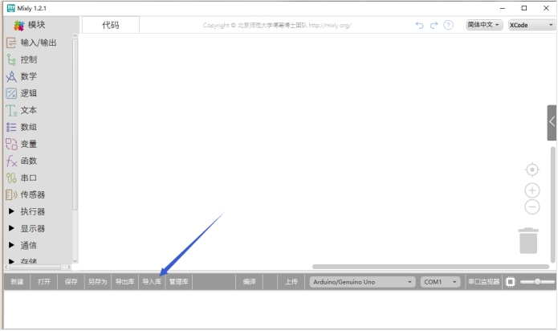 

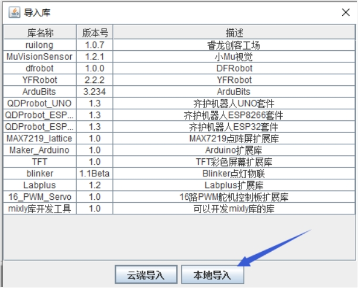 

点击本地导入

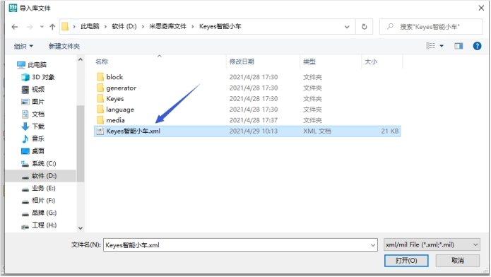 

选择我们文件里提供的keyes智能小车文件，这样米思奇库文件就导入完成了。

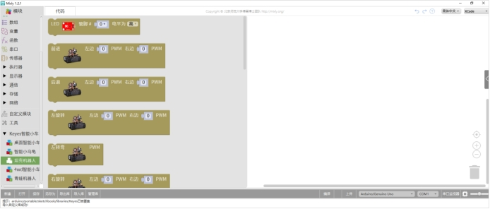 

 